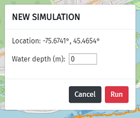
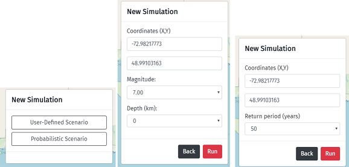
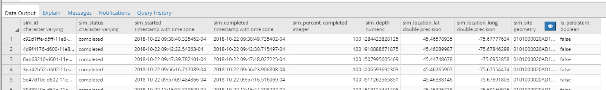
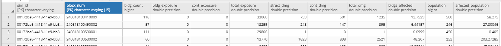

# ER2

ER2 (*Évaluateur rapide des risques*) is a web application for multi-hazard simulations. Earthquake and flood modules are currently operational.  The web development and earthquake module is led by the Geological Survey of Canada in Quebec, QC. The height above nearest drainage (HAND) inundation model used in ER2 Flood was provided by the Canadian Centre for Mapping and Earth Observation (CCMEO).


## Docker images (components of ER2)

The images are listed below. The core components are redis, the API, the worker, and the web.

**Nginx**

- [Github](./nginx)
- Image creator: Heryk, modified after <https://hub.docker.com/_/nginx>
- Latest image location: `\\<server-name-here>\images`
- Mapped volume: None
- Environment file: staging.env
- Current version: 0.1
- Run command: `docker run --name er2_nginx --rm -p xxxx:80 --network er2-net --env-file staging.env -v C:/er2-flood-backend/er2/nginx/cache:/etc/nginx/cache -v C:/er2-flood-backend/er2/nginx/error.log:/etc/nginx/error_log.log er2_nginx`
- Note: Currently not used
- Host entry port: xxxx
- Container entry port: 80

**Redis**

- Dockerhub:  <https://hub.docker.com/_/redis>
- Image creator: Docker official image
- Latest image location: `\\<server-name-here>\images`
- Mapped volume: None
- Environment file: None
- Current version: `redis.tar`
- Run command: `docker run --name redis --rm --network er2-net redis redis-server --requirepass <your-password>`

**Worker**

- [Github](./celery-queue)
- Image creator: Nicholas Gibb
- Latest image location: `\\<server-name-here>\images`
- Mapped volume: None
- Environment file: `staging.env`
- Current version: er2_worker:0.4 (`er2_worker_04.tar`)
- Run command: `docker run --name er2_worker --rm --network er2-net --env-file staging.env er2_worker`

**API**

- [Github](./api)
- Image creator: Nicholas Gibb
- Latest image location: `\\<server-name-here>\images`
- Mapped volume: None
- Environment file: `staging.env`
- Host entry port: xxxy
- Container entry port: xxxy
- Current version: er2_api:0.6 (`er2_api_06.tar`)
- Run command: `docker run --name er2_api --rm -p xxxy:xxxy --network er2-net --env-file staging.env er2_api`

**Web**

- [Github](./web)
- Image creator: Nicholas Gibb
- Latest image location: `\\<server-name-here>\images`
- Mapped volume: er2.sqlite, which holds website user credentials
- Environment file: `staging.env`
- Host entry port: xxxz
- Container entry port: xxxz
- Current version: er2_web:0.4 (`er2_web_04.tar`)
- Run command: `docker run --name er2_web --rm -p xxxz:xxxz --network er2-net --env-file staging.env -v C:/er2-flood-backend/er2/web/er2.sqlite:/home/er2/er2.sqlite er2_web`

**Mapserver**

- A series of map file configurations.

**Earthquake WPS**

- Dockerized

## Install/run/deploy ER2

This section details how to get started developing ER2 locally and how to deploy on the staging and production environment.

### Pre-requisites

1. Pull the repo: `git pull https://github.com/nrcan/er2.git`

2. Install Docker and Docker-Compose. Consult the Docker website for installation details.

3. Obtain environment variable file. Place it at the top level, alongside the `docker-compose.yml` file. This is detailed in the next subsection.

4. Obtain the er2.sqlite file. Place it in the `web` folder.

5. Obtain the `celery-queue\dependencies\dtmconditionedhandcropped_wgs841.tif` file. This is a large tif file that was too large to be pushed to Github.

#### Environment variables

The environment file includes the following variables:

- WEB: This is the URL for the front-end. Set it the IP address and port of the machine that runs the front-end server.

- ER2_API: This is the URL for the API. Set this to the IP address of the machine that runs the API server.

- FLASK_ENV: The Flask environment, set to production or development.

- SECRET_KEY: The secret key for cryptographically signing cookies. This is needed for the user session. Set as some random string.

- DEBUG: Flask debug. Set to True or False.

- WPS_EQ_URL: The URL for the earthquake web processing service (WPS).

- WPS_JOB_STATUS: The URL for checking the earthquake WPS job status.

- CELERY_BROKER_URL: [The broker URL](https://docs.celeryproject.org/en/latest/userguide/configuration.html#std:setting-broker_url) (redis).

- CELERY_RESULT_BACKEND: [The result backend](https://docs.celeryproject.org/en/latest/userguide/configuration.html#redis-backend-settings) (redis).

- Database credentials, i.e. host, port, user, password, and the databases.

- FLOOD_MAP_SERVICE: Mapserver URL for the flood component.

- EQ_MAP_SERVICE: Mapserver URL for the earthquake component.

- REGISTER_SECURITY_KEY: Security code for registering new users via the /register route.

*WARNING:* As detailed near the end of this document, there are separate databases in the development, staging, and production environments. For the application to run, **the API, Celery queue, earthquake WPS, and Mapserver must all access the same result database**. This involves choosing the correct environment variable URLs that also correspond to the Mapserver instance being used.

### Local development

In the command line, `cd` into the directory. Enter the command `docker-compose up --build`. Note: Add a `-d` flag if you wish to hide log messages and potential errors. The `--build` flag isn't actually necessary because the `docker-compose` file has a build instruction. If the images do not need to be built (e.g. for production environment), in the docker-compose file you can replace `build` with `image`.

To shut down running containers: `docker-compose down`

### Building the images

Ensure the latest images are built (e.g. `docker-compose up --build`).

These images cannot be shared on Dockerhub due to SSL issues on the NRCan network. So instead, save the Docker images as tar files:

Generic example: `docker save -o <path for generated tar file>/<name of generated tar file>.tar <image name>[:TAG]`

Specific example: `docker save -o C:/er2-flood-backend/docker_images/er2_web.tar er2_web`

The saved images and environment file can be passed to Alex for deployment on the staging and/or production server.

### DEV deployment

NOTE: Not fully functional because Mapserver is not connected to the <dev-server-name> database (so result layers cannot be shown).

Images and configuration files go to: \\<dev-server-name>\docker\images

Mapped volumes are in: \\<dev-server-name>\docker\mapped_volumes


### Staging deployment

Place staging images here: `\\<staging-server-name>\images`

Any updates to staging.env file must be done in or copied
 to: `\\<staging-server-name>\images\staging.env`

 Any updates to er2.sqlite file must be done in or copied to: \\<staging-server-name>\data\docker\mapped_volumes\er2\web

 You can use the `docker-compose.yml` file to start the containers. Or use `docker run` commands (after building the images), as given in the section above. But first ensure that you have a shared network, e.g. `docker network create er2-net`

### Production deployment

Place production images here: `\\<prod-server-name>\web\docker`

You first must be connected through OpenVPN.

Deployment instructions are similar to staging.

## How ER2 works

### Sequence diagrams

The sequence diagrams for ER2 Flood and Earthquake in the staging and production environments:

- [Flood, staging](./readme_imgs/deployment_diagrams/Earthquake/deploy_diagram_earthquake_staging.pdf)
- [Earthquake, staging](./readme_imgs/deployment_diagrams/Flood/deploy_diagram_flood_staging.pdf)
- [Flood, production](./readme_imgs/deployment_diagrams/Flood/deploy_diagram_flood_prod.pdf)
- [Earthquake, production](./readme_imgs/deployment_diagrams/Earthquake/deploy_diagram_earthquake_prod.pdf)

This GitHub repository has subfolders for certain components found in the sequence diagram, namely [Nginx](./nginx) (note: not in use), the [front-end (web client)](./web), the [API](./api), and the [Celery queue](./celery-queue). Mapserver is held in a separate repository. The Earthquake WPS is held locally.

Nginx is the reverse-proxy web server that receives HTTP requests from users. It is not currently being used on the staging or production servers, as the Apache server is functioning fine. But if ever needed, Nginx is in place. After the web server there is the WSGI application server, Gunicorn. Gunicorn is present in both the front-end (web client) and back-end (API), which were both built using Flask. [Flask is not a server](https://vsupalov.com/flask-web-server-in-production/); it is called by Gunicorn and the output is sent to the web server, which in turn delivers the HTTP response to the user.

A risk simulation is initiated with a POST request from the web client to the ER2 API. The API submits a task to the message broker, Redis. The Celery worker grabs tasks from the broker, returns a task ID to the client, and begins executing the task asynchronously (updating the database in the process; database SQL commands are done using the `psycopg2` Python library). The client uses the task ID to check progress. As the simulation proceeds, the API forms a JSON that is sent to the client. The client uses this JSON to make continual requests to Mapserver, which refreshes the result layers. Note that Mapserver is connected to the database.

This architecture is used for the flood module. Everything is in place for it to also be used for other modules (e.g. wildfire, GEM-Quake). The earthquake component, however, was developed earlier and has its own task queuing system (OGC web processing service). It is not fully detailed here. However, in brief, the API posts an XML file (template file: [api/eq_initiate_sim.xml](api/eq_initiate_sim.xml)) to the earthquake web processing service (WPS), which returns a task ID. With this task ID, the client can check progress. A GET request is sent to the monitoring url, which returns an XML file that contains the progress. Meanwhile, the WPS continually updates the database, which is used by MapServer to display the result layers.

### User credentials

User credentials are stored in the [er2.sqlite file](./web/er2.sqlite). This sqlite database was created using the SQL code in [schema.sql](./web/app/schema.sql). For persistence, this database is held as a volume outside the Docker container. Any updates to er2.sqlite file must be done in or copied to: `\\<staging-server-name>\data\docker\mapped_volumes\er2\web\er2.sqlite`

Users can be manually registered at `/register` route. The administrator password must be entered. Alternatively, it is probably preferable to connect to the database via Python. The file `database_edit` has some functionalities for this; you can make modifications as needed. Note that this file is in the `.dockerignore` file and thus not added to the image. Also note that you will need to enter the virtualenv in order to run this file (on Windows, `venv\Scripts\activate`).

This tutorial was followed with modifications to implement the user credentials: <https://flask.palletsprojects.com/en/1.1.x/tutorial/>

### Translations

ER2 is fully bilingual through use of `Flask-Babel`. Strings that need to be translated are marked as `{{ _("blah blah blah") }}`. To extract the list of strings to be translated, cd into the `web` directory, enter the virtual environment `venv` (on Windows: `venv/Scripts/activate`) and enter the command:

`pybabel extract -F babel.cfg -k _l -o messages.pot .`

Next, update the list:

`pybabel update -i messages.pot -d app/translations`

Edit the `messages.po` file. Compile your changes:

`pybabel compile -d app/translations`

This compile command adds a `mesages.mo` file next to `messages.po` in each language repo. The .mo file is the file that Flask-Babel uses to load translations.

### Base layers

The configuration file [apps.json](web/app/static/apps.json) includes a list of base layers. At startup, the JavaScript cycles through the list and makes an OpenLayers layer out of each (e.g. the census blocks in the Gatineau region).

For the earthquake module, the base layers are (1) the OpenStreetMap (OSM) layer; (2) the census tract polygons; (3) historical earthquakes; and (4) seismic regions. For the flood module, the base layers are (1) the OSM layer, (2) the census block polygons, (3) the HAND model, and (4) the boundary for the HAND model.

Note: For the moment, the OSM base layer is added directly via the JavaScript (i.e. hard coded and not included in the base layer list above).

### Map click

ER2 was designed to have an intuitive user experience. Both earthquake and flood simulations are initiated through a click on the map. For the earthquake module, the epicentre is located at the clicked point. For the flood module, the water level is set relative to the clicked point.

#### Flood

The HAND value for the clicked location is first fetched. The `x,y` coordinates are sent to the back-end service, i.e. `/tiffValue?x=${x}&y=${y}`.

This route calls the function `getTiffValue`, which runs as a Celery task (even though it returns a value in an inconsequential amount of time). For the passed `x,y` coordinate, the function determines the raster value using GDAL. _Note:_ In the future, we may eliminate this route and instead use service provided by Sherbrooke CCMEO (likely more convenient and logical).

If the `x,y` coordinates are outside the HAND geoTIFF boundary, there is no HAND value. The user is instructed to select a different location. If the coordinates are valid and a HAND value is returned, the hazard specification form is requested (i.e. `GET` request with `x`, `y`, and `srs` as parameters). For example the following request is sent to the API:

`forms/flood?_=1554236346005&x=-75.67502975&y=45.46843792&xRounded=-75.6750&yRounded=45.4684&srs=EPSG%3A4326`

This route returns the HTML content for the form. The form is displayed within a modal:



The user inputs the flood depth. The form is submitted (i.e. `POST` request) to the API route `/initiate`. This route is detailed later in this document.

#### Earthquake

With the earthquake module, a map click results in the form being requested (i.e. `GET` request with `x`, `y`, and `srs` as parameters). For example:

[/forms/eq?\_=1554236849731&x=-72.50976563&y=49.17272589&xRounded=-72.5098&yRounded=49.1727&srs=EPSG%3A4326]()

The form has two options:



The form is submitted via a `POST` request to the API route `eq/initiate`. This route is detailed later.

### Task queue and progress updates

Since risk calculations take a significant time, asynchronous task queuing is needed. For this, [Celery](http://www.celeryproject.org/) is used. Celery has three core components:

1. Celery _client_ (i.e. ER2 API): issues background jobs
2. Celery _workers_: processes that run the background jobs
3. _Message broker_: the client that communicates with the the workers through a message queue (here, [Redis](https://redis.io/)); needed to store and send task states

The ER2 API initializes the Celery client by creating an object of class Celery and passing the application name and the connection URL for the message broker:

[api/worker.py](api/worker.py)
```python
import os
from celery import Celery

# Configure location of Redis database
CELERY_BROKER_URL = os.environ.get('CELERY_BROKER_URL'),

# To store the state and return values of tasks in Redis
CELERY_RESULT_BACKEND = os.environ.get('CELERY_RESULT_BACKEND')

# Initializing the Celery client
celery = Celery('tasks', broker=CELERY_BROKER_URL, backend=CELERY_RESULT_BACKEND)
```

To kick off a task (a Celery worker process), the client issues a `POST` request to the ER2 API. For instance, here is the `/initiate` route (to start a flood simulation):

*[api/app.py](api/app.py)*
```python
@app.route("/initiate", methods=["POST"])
def initiate():
    # ...
    task = celery.send_task('tasks.calculate_damages', args=[x, y, waterLevel])
    response = {
        "type": "flood-task-status",
        "taskid": task.id,
        "task_status_url": url_for('task_status', task_id=task.id, external=True),
        "progress": "0",
        "status": "not-started",
    }
    return jsonify(response)
```

The `celery.send_task` sends a task to the Celery worker. In the `tasks.py` file, background tasks are declared with functions decorated by `celery.task`. If status updates are needed, the `bind=True` argument is added so that Celery sends a self argument to the function. For example:

*[celery-queue/tasks.py](celery-queue/tasks.py)*
```python
@celery.task(name='tasks.calculate_damages', bind=True)
def calculate_damages(self, x, y, waterLevel):
    # ...
```

The `task_status_url` (i.e. `/status/<task_id>` where `task_id` is a dynamic component) is returned so that the client can obtain status updates for the background task (i.e. a JSON that includes the task state and all the values set in `update_state()`):

*[api/app.py](api/app.py)*
```python
@app.route("/status/<task_id>", methods=["GET"])
def task_status(task_id):
    task = celery.AsyncResult(task_id)
    if task.state == "PENDING":
        # job did not start yet
        response = {
            "state": task.state,
            "actions": None,
            "current": 0,
            "total": 1,
            "progress": 0,
            "status": "not-started",
        }
    else:
        response = {
            "state": task.state,
            "actions": task.info.get("actions", 0),
            "current": task.info.get("current", 0),
            "total": task.info.get("total", 0),
            "progress": int(
                (task.info.get("current", 0) / task.info.get("total", 0)) * 100
            ),
            "status": task.info.get("status", 0),
        }
    return jsonify(response)
```

Note that Celery receives task updates through `self.update_state()`, within the `calculate_damages()` function:

```python
# Within the calculate_damages_task() function
self.update_state(
    state="PROGRESS",
    meta={
        "actions": actions,
        "current": ticker,
        "total": progressOutOf,
        "status": "ongoing",
        "progress": progress,
    },
)
```

Above, the state is `PROGRESS`. The client uses `current` and `total` to display a progress bar. The `actions` contains information on each of the layers to be loaded (for brevity the full action list is not shown here).

For further information on Celery and Flask: <https://blog.miguelgrinberg.com/post/using-celery-with-flask>

The software design was adopted from <https://github.com/mattkohl/docker-flask-celery-redis>. Flower was omitted, but can be re-implemented if task monitoring is needed.

The earthquake module was implemented differently. First, as with the flood module, the client issues a `POST` request to the `eq/initiate` route of the ER2 API. The ER2 API submits a XML to the earthquake web processing service (WPS). The WPS returns a task ID that is passed to the client. The client uses this task ID to check progress at the API route `/eq/status/<task_id>`. With each call, the API checks with the WPS, then prepares a JSON to be returned back to the client. This JSON contains the actions list, progress percent, status, task status URL, the task id, and, if the simulation is completed, the URL for the final HTML report. The client uses this information to show a progress bar and to request result layers from Mapserver (WMS).

### Database servers

There are two result databases: er2wps_results (earthquake) and flood_results_test (flood).

There are separate database servers for the local, staging, and production environments. Mapserver, the API, and the Celery queue connect to these database servers.

*Local*

- Name: DEV

- Address: `<dev-server-name>`

*Staging*

- Name: STAGING

- Address: `<staging-server-name>`

*Production*

- Name: PROD

- Address: `<prod-server-name>`

In each environment (local, staging, and production) there are two databases:

- For flood, the database is named `flood_results_test`. Essential tables/views: `gatineaublocks`, `flood_sim_result`, `flood_simulation`, and `flood_result_view_2`.

- For earthquake, the result database is named `er2wps_results`. Essential tables/views: `hz_tract`, `secan_r2`, `xyearthquakes_cleaned_2`, `job`, `job_result`, and `er2wps_view`.


#### Flood result database &mdash; `flood_results_test`

The flood database is called `flood_results_test` (_note:_ this database is no longer the test; it should be renamed). ER2 Flood uses two tables contained in this database, `flood_simulation` and `flood_sim_result`.

| Name                | Type  | Description                                                              | Accessed by    |
|---------------------|-------|--------------------------------------------------------------------------|----------------|
| gatineaublocks      | Table | Used to display census blocks in the Gatineau region                     | Mapserver      |
| flood_simulation    | Table | Record of simulations (sim_id, sim_started, sim_percent_completed, etc.) | Celery queue   |
| flood_sim_result    | Table | Flood simulation results with geometry (view used by Mapserver)          | Celery queue   |
| flood_result_view_2 | View  | Flood simulation results                                                 | Mapserver, API |

In the table `flood_simulation`, a record is made of each simulation (i.e. simulation ID, status, start time, completion time, percent completed, water depth, latitude, and longitude):



This record is updated as the simulation proceeds.

In the table `flood_sim_result` the results for each affected block are recorded. Presently there are fields for the building count, building exposure, content exposure, total exposure, structural damage, content damage, total damage, buildings affected, population, and affected population:



The database also has a table for the census blocks base layer (`gatineaublocks`). The geometry field is queried by Mapserver.

#### Earthquake result database &mdash; `er2wps_results`

The earthquake database is `er2wps_results`. Tables/views are detailed below.

| Name                    | Type  | Description                                                                             | Accessed by    |
|-------------------------|-------|-----------------------------------------------------------------------------------------|----------------|
| hz_tract                | Table | Census tracts (2006 boundaries)                                                         | Mapserver      |
| secan_r2                | Table | Earthquake regions                                                                      | Mapserver      |
| xyearthquakes_cleaned_2 | Table | Historical earthquakes                                                                  | Mapserver      |
| job                     | Table | Record of the job ID, job status, started/completed timestamps, hazard definition, etc. | -              |
| job_result              | Table | Earthquake simulation results (damages, losses) for individual census tracts.           | -              |
| er2wps_view             | View  | Earthquake simulation results (damages, losses) with geometry                           | Mapserver, API |

#### Inventory databases

For the flood module, the inventory is held in memory as csv files ([./celery-queue/dependencies](./celery-queue/dependencies)). For the earthquake module, the inventory is held in the database `evarisk_inventory`. It will not be documented here because it is only used/accessed by the earthquake WPS.

### How to Contribute

See [CONTRIBUTING.md](CONTRIBUTING.md)

### License
<a rel="license" href="http://creativecommons.org/licenses/by-nc/4.0/"></a><br />This work is licensed under a <a rel="license" href="http://creativecommons.org/licenses/by-nc/4.0/">Creative Commons Attribution-NonCommercial 4.0 International License</a>.

[Licence document](LIC-4029 ER2 CC-BY-NC English.docx.pdf)

The Canada wordmark and related graphics associated with this distribution are protected under trademark law and copyright law. No permission is granted to use them outside the parameters of the Government of Canada's corporate identity program. For more information, see [Federal identity requirements](https://www.canada.ca/en/treasury-board-secretariat/topics/government-communications/federal-identity-requirements.html).

#### Natural Resources Canada, Geological Survey of Canada
##### © His Majesty the King in Right of Canada as represented by the Minister of Natural Resources, 2024.